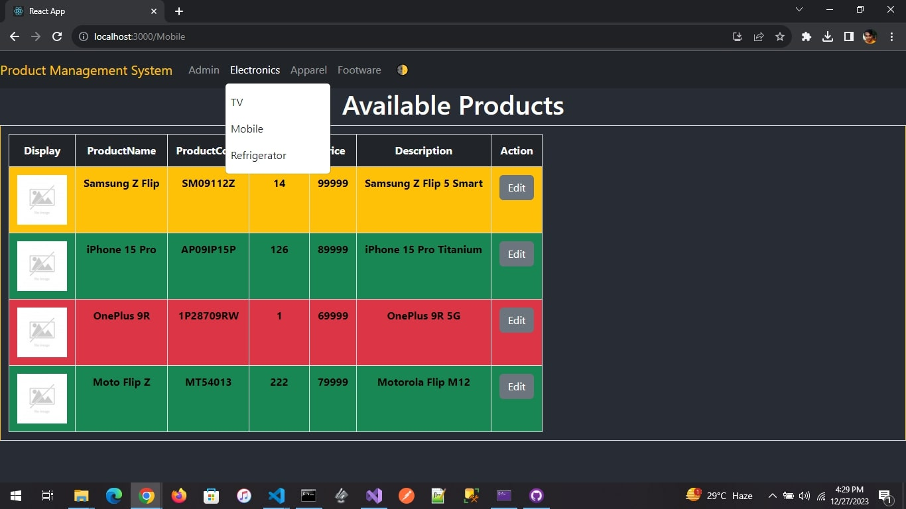

# Product Management System

## Problem Statement - 

Product management system help to manage (add, update, view and search) any kinds of products.
1.	User can search product based on category and subcategory (Category: Electronics                      ->Subcategory (TV, Mobile and refrigerator), Apparel-> Subcategory (Men’s Cloth and Women’s cloth) and Footwear-> (Men’s Footwear and kid’s footwears)) – Category and sub-category list can be in memory/pre-defined list.
2.	Product listing page should have columns (Product Code, Name, Quantity, Price, Product description and image)
3.	User should be able to add and edit products.
4.	 If product quantity is less than 10, then grid row background should be in red colour and if quantity between 10 to 100 it should be in orange colour and if quantity is more than 100 then it should be in green colour.

## Technical Stack:
1. Client Side - React 18.2.0 
        Dependencies - latest version of below libraries 
            axios
            bootstrap
            formik
            yup
            react-router-dom:
            reactjs-popup
2. Server Side - .Net Core Web API
        Dependencies - 
        Microsoft.AspNet.Mvc 7
3. ORM - EF Core
        Dependencies - 
            Microsoft.EntityFrameworkCore 7    
            Microsoft.EntityFrameworkCore.SqlServer 7
            Microsoft.EntityFrameworkCore.Tools 7
4. DataBase - SQL Server local DB

Reference Images - 

